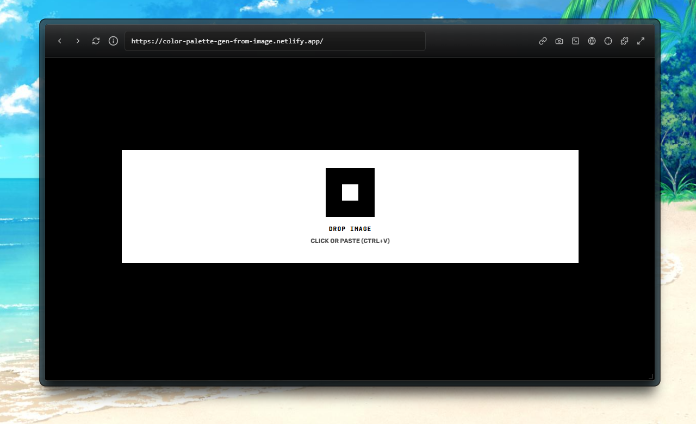
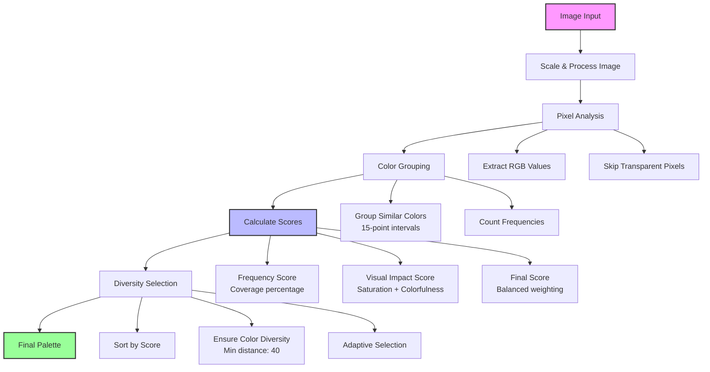

# COLOR PALETTE GENERATOR FROM IMAGE

[](https://app.netlify.com/projects/color-palette-gen-from-image/deploys)



A brutalist-designed web application that extracts dominant color palettes from images using advanced computer vision algorithms. Built with Next.js and TypeScript, featuring a bold black-and-white interface with industrial typography.

## Features

- **Smart Color Extraction**: Advanced algorithm that considers visual composition, spatial relevance, and aesthetic impact
- **Multiple Input Methods**: Upload files, drag & drop, or paste images directly (Ctrl+V)
- **Dual Format Output**: Get colors in both HEX and RGB formats
- **Instant Copy**: Click any color to copy to clipboard
- **Responsive Design**: Works seamlessly across desktop and mobile devices
- **Brutalist UI**: Bold, industrial design with harsh contrasts and geometric typography

## Algorithm Overview

The color extraction algorithm goes beyond simple frequency analysis to provide meaningful, contextually relevant color palettes:



### Algorithm Details

1. **Image Processing**: Scales image to optimal size (300px max) for performance
2. **Pixel Sampling**: Analyzes every pixel for maximum accuracy
3. **Smart Grouping**: Groups similar colors using 15-point intervals
4. **Multi-factor Scoring**:
   - **Frequency Score** (70%): How much space the color occupies
   - **Visual Impact** (30%): Saturation and colorfulness bonuses
5. **Diversity Selection**: Ensures colors are perceptually distinct (minimum distance: 40)
6. **Adaptive Fallback**: Gradually relaxes distance requirements if needed

## Getting Started

### Prerequisites

- Node.js 18.0 or later
- npm or yarn package manager

### Installation

1. **Clone the repository**

   ```bash
   git clone https://github.com/yourusername/image-palette.git
   cd image-palette
   ```
2. **Install dependencies**

   ```bash
   npm install
   # or
   yarn install
   ```
3. **Run development server**

   ```bash
   npm run dev
   # or
   yarn dev
   ```
4. **Open your browser**
   Navigate to [http://localhost:3000](http://localhost:3000)

### Build for Production

```bash
npm run build
npm start
```

## Usage

1. **Upload an Image**:

   - Click the upload area
   - Drag and drop an image
   - Paste an image using `Ctrl+V` (or `Cmd+V` on Mac)
2. **Extract Colors**:

   - The algorithm automatically processes your image
   - Wait for the "ANALYZING..." phase to complete
3. **Copy Colors**:

   - Click any color swatch to copy HEX value
   - Click HEX button to copy HEX format
   - Click RGB button to copy RGB format
4. **Download JSON**: Click the button to download the colors in JSON Format.

```json
   {
  "colors": [
    {
      "id": 1,
      "hex": "#1e2d2d",
      "rgb": "rgb(30, 45, 45)",
      "name": "Color 1"
    },
    {
      "id": 2,
      "hex": "#2d3c3c",
      "rgb": "rgb(45, 60, 60)",
      "name": "Color 2"
    },
    {
      "id": 3,
      "hex": "#3c5a5a",
      "rgb": "rgb(60, 90, 90)",
      "name": "Color 3"
    },
    {
      "id": 4,
      "hex": "#4b6969",
      "rgb": "rgb(75, 105, 105)",
      "name": "Color 4"
    },
    {
      "id": 5,
      "hex": "#d2b487",
      "rgb": "rgb(210, 180, 135)",
      "name": "Color 5"
    }
  ],
  "extractedAt": "2025-08-03T12:00:45.949Z",
  "totalColors": 5
}
```

## Use Cases

- **Design & Branding**: Extract brand colors from logos and imagery
- **UI/UX Design**: Create consistent color schemes from mockups
- **Photography**: Analyze color composition in photos
- **Fashion & Retail**: Match product colors and create collections
- **Interior Design**: Generate palettes from room photos
- **Marketing**: Ensure brand consistency across materials

## Contributing

1. Fork the repository
2. Create your feature branch (`git checkout -b feature/amazing-feature`)
3. Commit your changes (`git commit -m 'Add amazing feature'`)
4. Push to the branch (`git push origin feature/amazing-feature`)
5. Open a Pull Request

## License

This project is licensed under the MIT License - see the [LICENSE](LICENSE) file for details.

---

# ⚡Extract dominant colors from any image.

---

<table>
  <tr>
    <td align="left" width="50%">
      <strong>Maintained by</strong><br />
      Shaikh Rumman Fardeen<br />
      <a href="https://github.com/srummanf">GitHub: @srummanf</a><br />
      <a href="mailto:rummanfardeen4567@gmail.com">rummanfardeen4567@gmail.com</a>
    </td>
    <td align="right" width="50%">
      <strong>Project Links</strong><br />
      <a href="https://color-palette-gen-from-image.netlify.app/">Live Demo</a><br />
      <a href="https://github.com/srummanf/color-palette/">Source Code</a><br />
      <a href="./LICENSE">MIT License</a> | <a href="./CONTRIBUTING.md">Contributing</a>
    </td>
  </tr>
</table>
